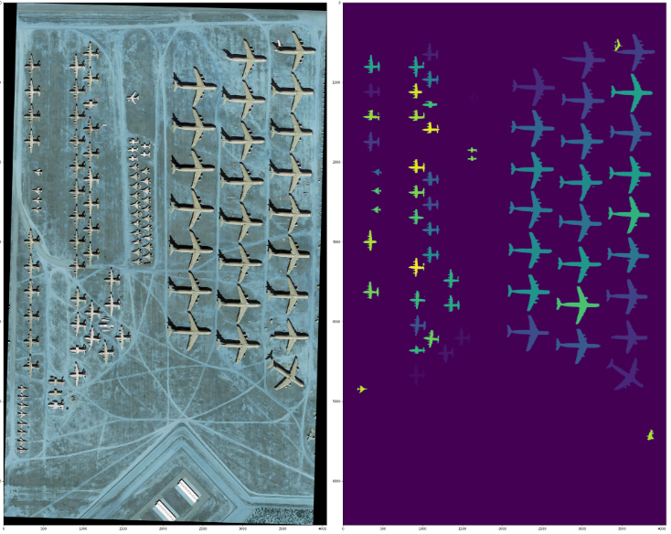

# Object Detection and Segmentation

## 1. Introduction

In this project, I used `Faster R-CNN` + `ResNeXt-101` + `FPN` + `Nested UNet` for the detection and segmentation of planes.

This project, with its codes and generated outcomes, is hosted on `Colab` at [Project Page - Part 1](https://colab.research.google.com/drive/1TSSWE-MK9oMgyO7_nkwZrFnukKzbco5P?usp=sharing) and [Project Page - Part 2](https://colab.research.google.com/drive/1kEhLJPAgAhhUHkAh3tqjc_RDHT83LiJr?usp=sharing). In this repository's local `.ipynb` files, most of the images and outcomes are removed to accommodate `Github`'s limit on file size.

For overview, technical details, and analysis of this project, please refer to my [report](report.pdf).

**Topics:** _Computer Vision_, _Object Detection_, _Object Segmentation_. _Semantic Segmentation_

**Skills:** _Pytorch_, _Python_, _Deep Neural Networks_, _Faster R-CNN_, _Nested UNet_, _Jupyter Lab_, _Colab_

## 2. Demo

Here is one sample of the results of detection and segmentation of planes:

For more results, please refer to my `colab` pages at [Project Page - Part 1](https://colab.research.google.com/drive/1TSSWE-MK9oMgyO7_nkwZrFnukKzbco5P?usp=sharing) and [Project Page - Part 2](https://colab.research.google.com/drive/1kEhLJPAgAhhUHkAh3tqjc_RDHT83LiJr?usp=sharing).
